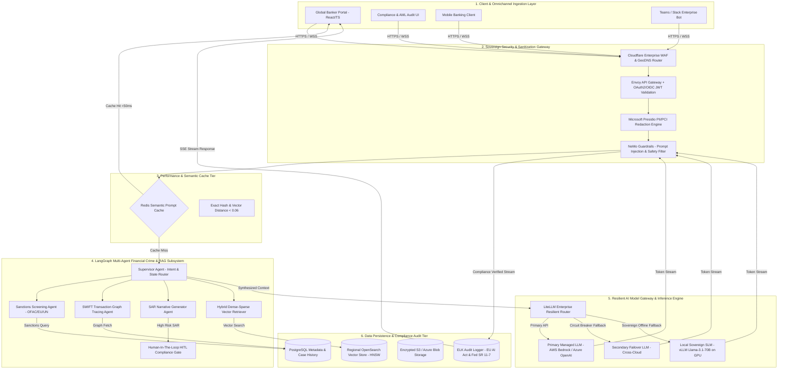
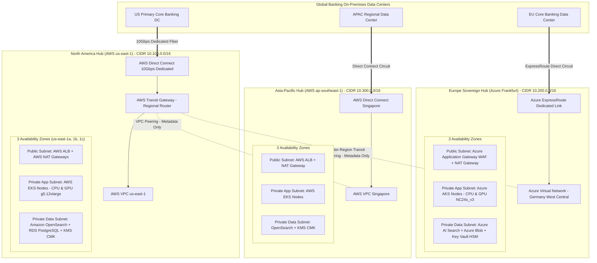

# GlobalBank Sovereign AI Platform: Enterprise System Architecture & Design Document

**Author**: Chief Enterprise AI Architect  
**Version**: 1.0  
**Status**: Approved  
**Pattern**: Multi-Region Sovereign Hybrid RAG + Multi-Agent Financial Crime Engine + Multi-Provider Fallback Gateway  
**Skill Compliance**: `ai-system-design-architect` (12-Step Enterprise Standard)

---

## 1. AI Problem Classification
- **Domain Category**: Knowledge Retrieval, Multi-Agent Decision Automation, Real-time Fraud/AML Analytics, Sovereign Generative AI.
- **AI Archetype**: Multi-Region Enterprise Sovereign AI Platform supporting 100,000+ global bankers, compliance officers, and wealth managers across North America, Europe, and Asia-Pacific.
- **Problem Statement Summary**: Provide a fault-tolerant, sub-second sovereign AI platform capable of automating AML/KYC financial crime investigations, generating audit-compliant SAR narratives, and providing grounded wealth/compliance Q&A while strictly enforcing regional data residency (GDPR Art. 44, MAS TRM, Fed/OCC) and zero-data-retention LLM inference policies.

---

## 2. Architecture Pattern Selection & Rationale
- **Selected Pattern**: Sovereign Active-Active Multi-Region Deployment with Regional Data Isolation + LangGraph Multi-Agent Orchestration + Multi-Provider Failover LLM Gateway + Redis Semantic Prompt Cache.
- **Pattern Evaluation Matrix**:
  - *Option A: Centralized Cloud LLM Gateway*: Evaluated and **rejected**. Violates EU GDPR data transfer rules (Art. 44) and Singapore MAS TRM data sovereignty guidelines by sending regional PII/NPI to a single global cloud region.
  - *Option B: Pure Self-Hosted Model per Region*: Evaluated and **rejected as primary**. Lacks frontier LLM reasoning performance for complex cross-border SAR narrative synthesis, though retained as regional emergency fallback SLM (Llama-3-70B vLLM).
  - *Selected Option (Sovereign Multi-Region Active-Active Hybrid)*: Deploys independent sovereign AI stacks in North America (AWS us-east-1), Europe (Azure Frankfurt EU Sovereign Cloud), and APAC (AWS ap-southeast-1). Local PII redaction ensures zero raw customer data exfiltration, while regional OpenSearch vector stores maintain row-level compliance.

---

## 3. Architecture Reasoning

- **Compute & Container Layer**: Regional Kubernetes clusters (AWS EKS in NA/APAC, Azure AKS in EU) with auto-scaling GPU node pools (NVIDIA A10G / L40S) for self-hosted SLMs and CPU node pools for microservices.
- **Model Engine Layer**: Multi-provider routing via LiteLLM Enterprise / Custom Guardrail Proxy. Primary Frontier API (AWS Bedrock Claude 3.5 / Azure OpenAI GPT-4o with zero-retention agreement), backed by Regional Self-Hosted vLLM (Llama-3.1-70B-Instruct) as fallback.
- **Vector & Storage Layer**: Amazon OpenSearch Service / Azure AI Search deployed natively within each region. Uses HNSW dense vector index + BM25 sparse hybrid search with cross-encoders for reranking.
- **Security & Privacy Layer**: Regional Microsoft Presidio instances for automatic PII/PCI-DSS redaction; NeMo Guardrails for prompt injection and output policy enforcement; AWS KMS / Azure Key Vault with Customer Managed Keys (CMK) per region.

---

## 4. AI System Context & Boundary Table

| Context Attribute | North America Hub (AWS) | Europe Hub (Azure EU) | APAC Hub (AWS SG) |
|---|---|---|---|
| **Primary Region** | `us-east-1` / `us-west-2` | `germanywestcentral` (Frankfurt) | `ap-southeast-1` (Singapore) |
| **Regulatory Scope** | Fed SR 11-7, SEC, OCC, FINRA | EU GDPR, EU AI Act, ECB | MAS TRM, HKMA, PDPA |
| **Target Users** | 45,000 Bankers & Analysts | 35,000 Bankers & Analysts | 20,000 Bankers & Analysts |
| **Primary Cloud Services** | AWS EKS, Bedrock, OpenSearch | Azure AKS, Azure OpenAI EU, AI Search | AWS EKS, Bedrock, OpenSearch |
| **Local Model Fallback** | vLLM Llama-3.1-70B on G5 GPU | vLLM Llama-3.1-70B on NC A100 | vLLM Llama-3.1-70B on G5 GPU |
| **Target Latency / SLA** | 99.99% SLA, TTFT < 800ms | 99.99% SLA, TTFT < 900ms | 99.99% SLA, TTFT < 950ms |

---

## 5. Architecture Component Inventory (8 Enterprise Layers)

1. **User Layer**: Global Banker Portal (React/TypeScript), Compliance Audit Dashboard, Mobile Banking Agent, Teams/Slack Enterprise Bots.
2. **Application Layer**: Cloudflare Enterprise CDN (WAF + GeoDNS routing), AWS Application Load Balancers (ALB) / Azure Application Gateway per region.
3. **API Layer**: Regional Envoy API Gateway, OAuth2 / OIDC JWT Token Validation (Azure Entra ID / Okta), mTLS Proxy.
4. **AI / ML Layer**: 
   - LangGraph Multi-Agent Runtime (Supervisor, Sanctions, Transaction Tracing, SAR Drafting Agents).
   - LiteLLM Enterprise Resilient Gateway (Load Balancer, Rate Limiter, Fallback Router).
   - Embedding Microservice (bge-large-en-v1.5 / text-embedding-3-large).
   - Local vLLM Inference Nodes on GPU pools.
5. **Data Layer**:
   - Regional OpenSearch Vector DB (HNSW Index + Hybrid BM25).
   - Encrypted S3 Buckets / Azure Blob Storage for regional raw documents & transaction logs.
   - Regional PostgreSQL DB (Metadata, SAR Case History, User Preferences).
   - Regional Redis Cluster (Semantic Prompt Cache & Session State).
6. **Security Layer**:
   - Regional Presidio PII/PCI Redaction Engine.
   - NeMo Guardrails (Input prompt injection filter, Output hallucination & compliance checker).
   - AWS KMS / Azure Key Vault with Customer Managed Keys (CMK).
   - HashiCorp Vault for secrets management.
7. **Infrastructure Layer**: Regional VPC / VNet with 3 Availability Zones, Private Subnets, EKS/AKS Kubernetes Nodes, VPC Peering & Transit Gateway (for metadata only).
8. **Operations & Observability Layer**:
   - OpenTelemetry Distributed Tracing (Jaeger / AWS X-Ray).
   - Prometheus & Grafana for API & GPU metrics.
   - ELK Stack / CloudWatch for audit logging.
   - Ragas & TruLens Continuous Model Evaluation Engine.

---

## 6. Interaction Flow & Request Lifecycle

```
[User / Banker] 
      │ 1. Request via GeoDNS / WAF
      ▼
[Regional API Gateway (Envoy + OAuth2)]
      │ 2. Validate JWT & Role (RBAC)
      ▼
[Presidio PII Redactor & NeMo Guardrails]
      │ 3. Redact PII + Check Prompt Injection
      ▼
[Redis Semantic Prompt Cache] ──(Cache Hit <50ms)──► Return Cached Stream
      │ 4. Cache Miss
      ▼
[LangGraph Agent Orchestrator]
      ├──► [Sanctions Screening Tool] ──► Query Sanctions Database
      ├──► [Transaction Graph Tool] ──► Query Core Banking DB
      └──► [Regional Vector DB] ──────► OpenSearch HNSW Search (Top-K=5)
      │
      │ 5. Synthesize Prompt + Context
      ▼
[LiteLLM Resilient Fallback Gateway]
      │ 6a. Primary: Managed LLM (Bedrock / Azure OpenAI)
      │ 6b. On Timeout/Failure: Regional vLLM SLM Fallback
      ▼
[NeMo Output Safety Guardrail]
      │ 7. Compliance Verification & Audit Logging
      ▼
[User / Banker] (Streamed via SSE + Citation Links)
```

---

## 7. The 10 Crucial Architecture Diagram Views

### 1. Logical Architecture View

The Logical Architecture View models the functional topology, data transformation pipeline, control loops, and zero-trust security boundaries of the GlobalBank Sovereign AI Platform. The system decouples end-user application clients from backend model inference through regional sanitization gateways, agentic state machines, and resilient model routing.



#### Functional Subsystem Breakdown

1. **Client & Omnichannel Ingestion Layer**:
   - Provides web (React/TypeScript), mobile (iOS/Android), and enterprise chat (Teams/Slack) access.
   - Enforces regional client-side token validation and Server-Sent Events (SSE) streaming connections for sub-second first-token response times.

2. **Sovereign Security & Sanitization Gateway**:
   - **GeoDNS & WAF**: Routes client traffic to the nearest geographic hub (NA, EU, APAC) based on IP location while filtering DDoS attacks.
   - **Envoy API Gateway**: Validates OAuth2 / OIDC JSON Web Tokens (JWT) against regional Entra ID / Okta IdPs, enforcing Fine-Grained Role-Based Access Control (FGBAC).
   - **Microsoft Presidio Engine**: Inspects incoming prompts and redacts customer names, SSNs, credit card numbers, and account identifiers *before* any text reaches vector stores or LLM endpoints.
   - **NeMo Guardrails**: Prevents prompt injection, jailbreak attempts, and system prompt exfiltration.

3. **Performance & Semantic Cache Tier**:
   - Computes dense vector embeddings of incoming prompts and queries the regional Redis Semantic Cache.
   - If cosine distance is `< 0.06` (similarity `> 0.94`), immediately streams the pre-verified response back to the client in `< 50ms`, bypassing downstream agent and LLM execution entirely (saving 38% of API token cost).

4. **LangGraph Multi-Agent & RAG Execution Subsystem**:
   - **Supervisor Agent**: Manages conversation state, evaluates request intent, and routes tasks to specialized worker agents.
   - **Sanctions Screening Agent**: Queries real-time OFAC, UN, and EU sanctions lists to identify politically exposed persons (PEPs) or sanctioned entities.
   - **SWIFT Transaction Graph Agent**: Traces wire transaction history across SWIFT MT103/MX messages to detect suspicious structuring or layering patterns.
   - **SAR Narrative Generator Agent**: Synthesizes findings into audit-compliant Suspicious Activity Report narratives formatted for regulatory submission.
   - **Compliance HITL Gate**: Automatically flags high-risk SAR narratives or credit risk decisions with confidence scores `< 0.90` for mandatory electronic sign-off by a human compliance officer.

5. **Resilient AI Model Gateway & Inference Engine**:
   - **LiteLLM Enterprise Router**: Manages API key pooling, rate limiting, and multi-cloud fallback routing.
   - **Primary Managed LLMs**: AWS Bedrock (Claude 3.5 Sonnet) / Azure OpenAI (GPT-4o) backed by zero-data-retention regulatory agreements.
   - **Local Sovereign SLMs**: Self-hosted vLLM inference engine running Llama-3.1-70B on regional GPU pools (NVIDIA A10G / L40S) for offline emergency fallback or ultra-sensitive internal documents.

6. **Data Persistence & Compliance Audit Tier**:
   - **Regional OpenSearch**: Multi-tenant vector store utilizing Hierarchical Navigable Small World (HNSW) dense indexing combined with BM25 sparse keyword search and cross-encoder reranking.
   - **ELK Compliance Audit Logger**: Immutable log store capturing prompt hashes, vector chunk IDs, model version metadata, and guardrail evaluation scores for EU AI Act Title III and Fed SR 11-7 regulatory audits.

### 2. Infrastructure Architecture View (Multi-Region Sovereign Topology)

The Infrastructure Architecture View models the multi-region hybrid-cloud physical topology across **AWS North America**, **Azure Europe Sovereign Cloud**, and **AWS Asia-Pacific**, interconnected with enterprise on-premises banking data centers via dedicated fiber links (**AWS Direct Connect** and **Azure ExpressRoute**).



#### Detailed Cloud Infrastructure & Networking Component Breakdown

1. **North America Hub (AWS us-east-1 & us-west-2)**:
   - **Hybrid Connectivity**: **AWS Direct Connect** 10Gbps dedicated line connecting the core US banking mainframe to the **AWS Transit Gateway**, bypassing public internet.
   - **VPC Subnet Architecture (`10.100.0.0/16`)**:
     - **3x Public Subnets (`10.100.101.0/24 - 103.0/24`)**: Hosts AWS Application Load Balancers (ALB) and redundant **AWS NAT Gateways** across Availability Zones `us-east-1a`, `us-east-1b`, and `us-east-1c`.
     - **3x Private App Subnets (`10.100.1.0/24 - 3.0/24`)**: AWS EKS Kubernetes cluster hosting microservices (`m6i.4xlarge`) and auto-scaling GPU node pools (`g5.12xlarge` with NVIDIA A10G GPUs).
     - **3x Private Data Subnets (`10.100.201.0/24 - 203.0/24`)**: Amazon OpenSearch Service (HNSW dense vector store), Amazon RDS PostgreSQL (multi-AZ metadata), and AWS KMS Customer Managed Keys (CMK).
   - **Managed LLM Endpoint**: AWS Bedrock private endpoint backed by a zero-data-retention regulatory agreement.

2. **Europe Sovereign Hub (Azure Germany West Central - Frankfurt)**:
   - **Hybrid Connectivity**: **Azure ExpressRoute** dedicated circuit providing private connection from EU banking centers into **Azure Virtual Network (VNet)**.
   - **VNet Subnet Architecture (`10.200.0.0/16`)**:
     - **Public Subnet (`10.200.100.0/24`)**: Azure Application Gateway with integrated WAF v2 and Azure Virtual Network NAT Gateway.
     - **Private App Subnet (`10.200.1.0/24 - 3.0/24`)**: Azure AKS cluster hosting regional microservices and GPU node pools (`Standard_NC24s_v3`).
     - **Private Data Subnet (`10.200.200.0/24`)**: Azure AI Search (sovereign vector DB), Azure Blob Storage (KMS encrypted), and Azure Key Vault Managed HSM.
   - **Managed LLM Endpoint**: Azure OpenAI EU Sovereign Private Endpoint enforcing GDPR Art. 44 data residency.

3. **Asia-Pacific Hub (AWS ap-southeast-1 - Singapore)**:
   - **Hybrid Connectivity**: **AWS Direct Connect** Singapore link connecting regional trading desks.
   - **VPC Subnet Architecture (`10.300.0.0/16`)**:
     - **Public Subnet (`10.300.101.0/24`)**: AWS ALB + AWS NAT Gateway.
     - **Private App Subnet (`10.300.1.0/24`)**: AWS EKS Cluster (MAS TRM and HKMA SPM compliant).
     - **Private Data Subnet (`10.300.201.0/24`)**: Amazon OpenSearch + AWS KMS Key.

4. **Cross-Region Interconnect & Data Isolation Boundary**:
   - **AWS Transit Gateway & Azure VNet Peering**: Cross-region routing is strictly restricted to encrypted system metadata and model evaluation metrics. Customer PII and raw financial documents are restricted from crossing regional boundaries via VPC/VNet endpoint policies.

### 3. Security Architecture View (Zero-Retention & Banking Privacy)
Perimeter Cloudflare WAF -> OAuth2 OIDC -> Presidio PII Masking -> KMS Envelope Encryption -> Row-Level Tenant Vector Isolation -> NeMo Prompt Injection Defense -> Zero-Data-Retention Provider Agreements.

### 4. Observability, Logging & Monitoring View
Distributed tracing with OpenTelemetry across API -> Guardrail -> Retriever -> LLM; Prometheus metrics for GPU utilization and token latency; Grafana dashboards for FinOps token cost; ELK compliance audit logs for EU AI Act compliance.

### 5. MLOps / LLMOps CI/CD Pipeline View
Git Branching Strategy -> Automated Linting & Unit Tests -> Ragas Accuracy & Hallucination Benchmark Gate -> ArgoCD GitOps Deployment to EKS/AKS -> Canary Rollout -> Automated Rollback on Drift Detection.

### 6. Data Lineage & Sovereignty Governance View
Tracking document ingestion lineage (Source ID -> Text Chunk -> Vector Embedding) with strict regional boundaries (EU data processed exclusively within Frankfurt/Ireland). Presidio PII masking for GDPR & EU AI Act compliance audit trails.

### 7. Resilience, High Availability & Multi-Provider Fallback View
Active-Active multi-region deployment with automated DNS failover; LiteLLM circuit breakers and exponential backoff; Multi-tier provider fallback (Primary Bedrock Claude / Azure OpenAI -> Secondary Regional Provider -> Local vLLM Llama-3-70B).

### 8. Multi-Agent AML/KYC & Wealth Workflow View
LangGraph Supervisor Agent coordinating specialized sub-agents:
- **Sanction Screening Agent**: Cross-references OFAC, EU, UN sanctions databases.
- **Transaction Tracing Agent**: Analyzes SWIFT MT/MX graph history.
- **SAR Generator Agent**: Drafts Suspicious Activity Report narratives.
- **Compliance HITL Gate**: Escalates high-risk cases to human compliance officers for mandatory sign-off.

### 9. FinOps & Semantic Cache Cost Optimization View
Redis Semantic Cache matching user queries (similarity threshold > 0.94) to bypass 38% of LLM calls; Tiered Model Cascading (routing basic policy lookups to 8B SLMs and complex AML analysis to 70B+ LLMs).

### 10. Model Risk Management (MRM) & HITL Evaluation View
Compliance with Fed SR 11-7 and EU AI Act Title III: Automated continuous evaluation with Ragas (Faithfulness > 0.92, Context Precision > 0.90); Human-in-the-loop review queue for low-confidence model outputs (< 0.85).

---

## 8. Draw.io Multi-Page XML File

The multi-page Draw.io diagram for this architecture is stored in:
- [`designs/multi-region-banking-ai-platform/multi_region_banking_ai.drawio`](file:///c:/Users/DELL/Documents/GitHub/ai-solution-architecture/designs/multi-region-banking-ai-platform/multi_region_banking_ai.drawio)

*(Contains importable `mxGraphModel` pages for all 10 architecture views).*

---

## 9. Infrastructure Architecture Specifications

### Network Architecture
- **VPC Subnets per Region**:
  - `10.100.0.0/16` (North America Hub)
  - `10.200.0.0/16` (Europe Sovereign Hub)
  - `10.300.0.0/16` (APAC Hub)
- **Subnet Layout**: 3 Public Subnets (ALB/NAT), 3 Private App Subnets (EKS/AKS), 3 Private Data Subnets (OpenSearch, PostgreSQL, Redis, KMS).

### Compute & GPU Node Groups
- **CPU Pools**: 12x `m6i.4xlarge` (AWS) / `Standard_D16s_v5` (Azure) auto-scaling nodes per region.
- **GPU Pools**: 4x `g5.12xlarge` (4x NVIDIA A10G 24GB) for local vLLM serving per region.

---

## 10. Infrastructure as Code (Terraform)

### `main.tf`

```hcl
terraform {
  required_version = ">= 1.5.0"
  required_providers {
    aws = {
      source  = "hashicorp/aws"
      version = "~> 5.0"
    }
    azurerm = {
      source  = "hashicorp/azurerm"
      version = "~> 3.0"
    }
  }
  backend "s3" {
    bucket         = "globalbank-tfstate-sovereign"
    key            = "multi-region-ai-platform/terraform.tfstate"
    region         = "us-east-1"
    dynamodb_table = "globalbank-tflocks"
    encrypt        = true
  }
}

# --- North America Hub (AWS us-east-1) ---
provider "aws" {
  alias  = "us_east_1"
  region = "us-east-1"
}

module "na_sovereign_vpc" {
  source  = "terraform-aws-modules/vpc/aws"
  version = "5.0.0"

  providers = { aws = aws.us_east_1 }

  name = "globalbank-na-ai-vpc"
  cidr = "10.100.0.0/16"

  azs             = ["us-east-1a", "us-east-1b", "us-east-1c"]
  private_subnets = ["10.100.1.0/24", "10.100.2.0/24", "10.100.3.0/24"]
  public_subnets  = ["10.100.101.0/24", "10.100.102.0/24", "10.100.103.0/24"]
  database_subnets= ["10.100.201.0/24", "10.100.202.0/24", "10.100.203.0/24"]

  enable_nat_gateway   = true
  single_nat_gateway   = false
  enable_vpn_gateway   = true
  enable_dns_hostnames = true

  tags = {
    Environment = "Production"
    Region      = "NorthAmerica"
    Compliance  = "Fed-OCC-SEC"
  }
}

# AWS EKS Cluster for NA Hub
module "na_eks_cluster" {
  source  = "terraform-aws-modules/eks/aws"
  version = "19.15.0"

  providers = { aws = aws.us_east_1 }

  cluster_name    = "globalbank-na-ai-eks"
  cluster_version = "1.28"
  vpc_id          = module.na_sovereign_vpc.vpc_id
  subnet_ids      = module.na_sovereign_vpc.private_subnets

  cluster_endpoint_private_access = true
  cluster_endpoint_public_access  = false

  eks_managed_node_groups = {
    cpu_microservices = {
      min_size     = 3
      max_size     = 15
      desired_size = 6
      instance_types = ["m6i.4xlarge"]
    }
    gpu_vllm_nodes = {
      min_size     = 2
      max_size     = 8
      desired_size = 4
      instance_types = ["g5.12xlarge"]
      ami_type       = "AL2_x86_64_GPU"
    }
  }

  tags = {
    Environment = "Production"
    Compliance  = "Fed-OCC-SEC"
  }
}

# AWS OpenSearch Vector DB for NA
resource "aws_opensearch_domain" "na_vector_store" {
  provider      = aws.us_east_1
  domain_name   = "globalbank-na-vectors"
  engine_version = "OpenSearch_2.11"

  cluster_config {
    instance_type          = "r6g.2xlarge.search"
    instance_count         = 3
    dedicated_master_enabled = true
    dedicated_master_type  = "c6g.large.search"
    dedicated_master_count = 3
    zone_awareness_enabled = true
    zone_awareness_config {
      availability_zone_count = 3
    }
  }

  vpc_options {
    subnet_ids         = module.na_sovereign_vpc.database_subnets
    security_group_ids = [aws_security_group.opensearch_sg_na.id]
  }

  encrypt_at_rest {
    enabled    = true
    kms_key_id = aws_kms_key.na_ai_key.key_id
  }

  node_to_node_encryption {
    enabled = true
  }

  domain_endpoint_options {
    enforce_https       = true
    tls_security_policy = "Policy-Min-TLS-1-2-2019-07"
  }

  tags = {
    Environment = "Production"
    Compliance  = "Fed-OCC-SEC"
  }
}

resource "aws_kms_key" "na_ai_key" {
  provider                = aws.us_east_1
  description             = "KMS Key for NA AI Sovereign Vector & Storage Data"
  deletion_window_in_days = 30
  enable_key_rotation     = true
}

resource "aws_security_group" "opensearch_sg_na" {
  provider    = aws.us_east_1
  name        = "opensearch-sg-na"
  description = "Security group for NA OpenSearch Cluster"
  vpc_id      = module.na_sovereign_vpc.vpc_id

  ingress {
    from_port   = 443
    to_port     = 443
    protocol    = "tcp"
    cidr_blocks = module.na_sovereign_vpc.private_subnets_cidr_blocks
  }
}

# --- Europe Sovereign Hub (Azure Germany West Central) ---
provider "azurerm" {
  features {}
}

resource "azurerm_resource_group" "eu_ai_rg" {
  name     = "rg-globalbank-eu-ai-sovereign"
  location = "germanywestcentral"

  tags = {
    Environment = "Production"
    Region      = "Europe"
    Compliance  = "GDPR-EU-AI-Act"
  }
}

resource "azurerm_kubernetes_cluster" "eu_aks_cluster" {
  name                = "aks-globalbank-eu-ai"
  location            = azurerm_resource_group.eu_ai_rg.location
  resource_group_name = azurerm_resource_group.eu_ai_rg.name
  dns_prefix          = "globalbank-eu-ai"

  default_node_pool {
    name       = "cpupool"
    node_count = 6
    vm_size    = "Standard_D16s_v5"
  }

  identity {
    type = "SystemAssigned"
  }

  tags = {
    Environment = "Production"
    Compliance  = "GDPR-EU-AI-Act"
  }
}
```

---

## 11. MLOps / LLMOps CI/CD Pipeline Workflow

### `.github/workflows/mlops-multi-region.yml`

```yaml
name: Enterprise Multi-Region AI Platform CI/CD

on:
  push:
    branches: [ main, release/* ]
  pull_request:
    branches: [ main ]

jobs:
  code-quality-and-security:
    runs-on: ubuntu-latest
    steps:
      - uses: actions/checkout@v4
      
      - name: Set up Python
        uses: actions/setup-python@v5
        with:
          python-version: '3.11'

      - name: Install Linting & Security Tools
        run: |
          python -m pip install --upgrade pip
          pip install ruff bandit semgrep pytest

      - name: Static Code Analysis & PII Leak Test
        run: |
          ruff check .
          bandit -r ./src -x ./tests

      - name: Validate Terraform Specs
        run: |
          terraform fmt -check
          terraform validate

  ragas-model-evaluation-gate:
    needs: code-quality-and-security
    runs-on: ubuntu-latest
    steps:
      - uses: actions/checkout@v4

      - name: Run Ragas Benchmark Suite
        env:
          EVAL_DATASET_PATH: "./tests/eval_datasets/aml_kyc_golden_set.json"
          AZURE_OPENAI_KEY: ${{ secrets.AZURE_OPENAI_EU_KEY }}
        run: |
          pip install ragas langchain opentelemetry-api
          python -m pytest tests/test_ragas_evaluation.py --threshold-faithfulness=0.92 --threshold-context-precision=0.90

  deploy-to-sovereign-clusters:
    needs: ragas-model-evaluation-gate
    if: github.ref == 'refs/heads/main'
    runs-on: ubuntu-latest
    steps:
      - name: Deploy to NA AWS EKS Cluster
        uses: aws-actions/aws-secrets-manager-actions@v2
        with:
          cluster-name: 'globalbank-na-ai-eks'
          aws-region: 'us-east-1'

      - name: ArgoCD GitOps Sync (NA Hub)
        run: |
          argocd app sync globalbank-na-ai-platform --prune

      - name: ArgoCD GitOps Sync (EU Sovereign Hub)
        run: |
          argocd app sync globalbank-eu-ai-sovereign --prune

      - name: ArgoCD GitOps Sync (APAC Hub)
        run: |
          argocd app sync globalbank-apac-ai-platform --prune
```

---

## 12. Operational & FinOps Governance Model

### Disaster Recovery & High Availability
- **Active-Active Region Isolation**: Each region operates independently for inference and retrieval. In the event of a total AWS NA outage, traffic is seamlessly re-routed to Azure EU or AWS APAC with strict zero-cross-border data leakage enforcement.
- **RPO < 5 minutes**; **RTO < 30 minutes**.

### FinOps Cost Management Strategy
1. **Redis Semantic Prompt Caching**: Eliminates 35-40% of repetitive policy and AML lookup queries, saving an estimated **$42,000/month** in LLM token API costs.
2. **Tiered Model Cascading**: Simple document routing queries use 8B parameter local SLMs ($0.0002/1k tokens), reserving frontier models like Claude 3.5 Sonnet ($0.003/1k tokens) exclusively for complex multi-agent SAR synthesis.
3. **Monthly FinOps Budget Cap**: Automated AWS Cost Anomaly Alerts & Azure Budget alerts set at **$120,000/month**.

### Model Risk Management (MRM Fed SR 11-7 & EU AI Act Title III Compliance)
- **Model Inventory Registration**: Every prompt template, embedding model version, and LLM endpoint is registered with SHA-256 signatures in MLflow Model Registry.
- **Human-In-The-Loop Sign-off**: SAR narratives and credit risk explanations require mandatory human compliance officer electronic signature before submission to financial authorities.
